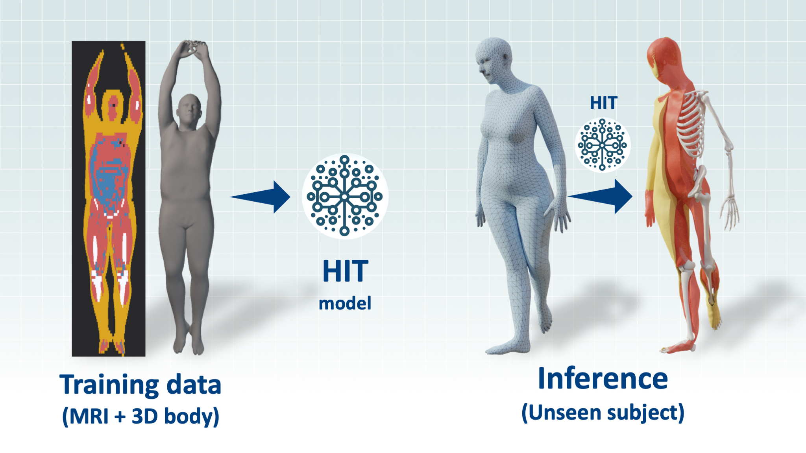
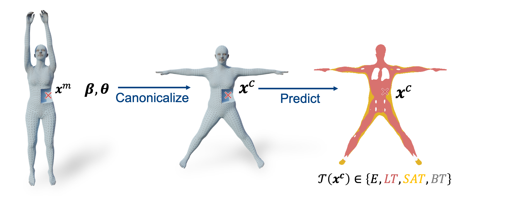
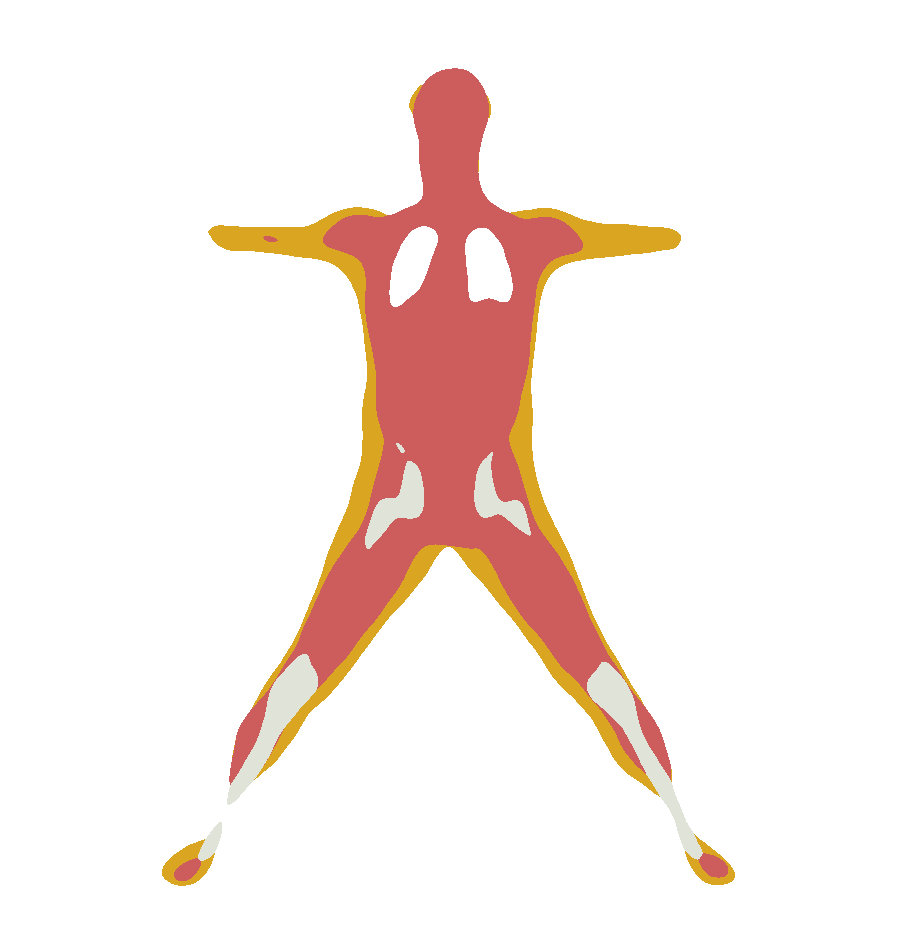
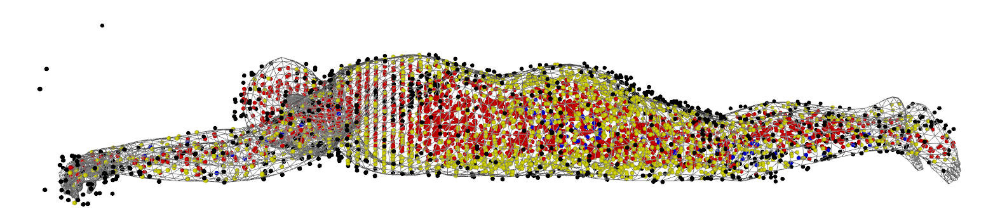
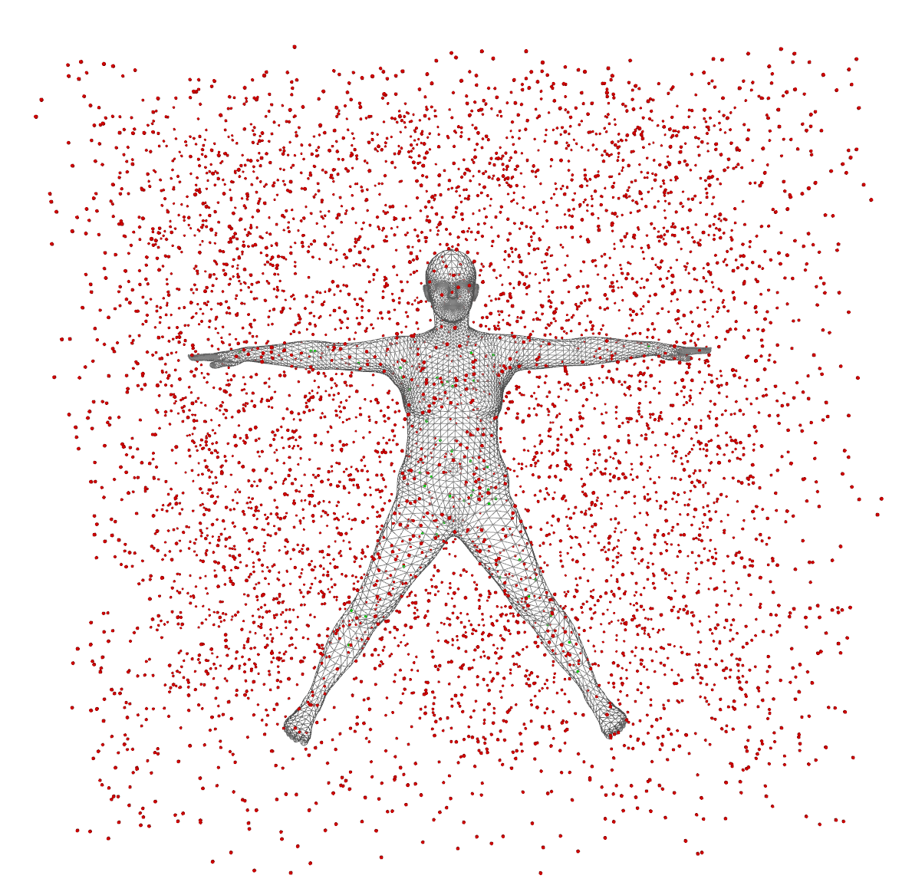

# HIT

Official repo of the CVPR 2024 paper: *HIT: Estimating Internal Human Implicit Tissues from the Body Surface*

[[paper]](https://hit.is.tue.mpg.de/media/upload/4978.pdf) [[project page]](https://hit.is.tue.mpg.de/)



## Table of Contents
<!-- outline -->
- [What is HIT ?](#what-is-hit-)
- [Content of this repo](#content-of-this-repo)
- [Installation](#installation)
- [Demos](#demos)
- [Dataset](#dataset)
- [Training HIT](#training)
- [Testing HIT](#testing)

## What is HIT ?
HIT is a neural network that learns to infer the internal tissues of the human body from its surface. The input is a 3D body represented as SMPL parameters (a shape vector β and a pose vector θ) and a 3D point coordinates. The output is the probability of the input point being inside the following tissue:
- lean tissue (muscles, organs) (LT)
- adipose tissue (subcutaneous) (AT)
- bone (BT)
- empty space (inside the lungs, outside the body) (E)

The implicit HIT function can also be used to generate the 3D mesh of the tissues using the marching cube algorithm.

The figure below illustrates our approach. Given a posed body shape (β, θ), and a 3D point xm, HIT first canonicalizes this point to the corresponding location xc inside an average template body, and then predicts the class of the tissue at location xc.



## Content of this repo

This repo contains the code to train and test HIT on the HIT dataset (available on our project page). It also contains some demo code to infer the tissue meshes for a given SMPL body.


# Installation

This code is tested on Ubuntu 20.04 with Python 3.8. We do not guarantee that it will work on other systems.

```shell
git clone https://github.com/MarilynKeller/HIT 
cd hit
```

#### Set up a virtual environment
```shell
python3.8 -m venv hit_venv
source hit_venv/bin/activate
pip install -r requirements.txt
```

#### Install packages
Check your CUDA toolkit version
```shell
nvcc --version
```
Install torch depending on CUDA toolkit version. See: https://pytorch.org/get-started/previous-versions/ . 

For 11.8:
```shell
pip install torch==2.2.0 torchvision==0.17.0 torchaudio==2.2.0 --index-url https://download.pytorch.org/whl/cu118
```


Install relevant packages
```shell
pip install -r requirements.txt
pip install  git+https://github.com/MPI-IS/mesh.git
pip install  git+https://github.com/mattloper/chumpy
pip install -e .
```

The **LEAP** package is used for its marching cube implementation and creating ground truth occupancy. Install it with:
```shell
cd hit
mkdir external
cd external 
git clone https://github.com/neuralbodies/leap.git
cd leap
python setup.py build_ext --inplace
pip install -e .
```

#### SMPL model files
Download the SMPL model from https://smpl.is.tue.mpg.de/ and update the path `smplx_models_path` in `hit_config.py` to the proper path.
The folder hierarchy should be the following:
```
${MODELS}
├── smpl
│   ├── SMPL_FEMALE.pkl
│   └── SMPL_MALE.pkl
│   └── SMPL_NEUTRAL.pkl
├── smplh
│   ├── SMPLH_FEMALE.pkl
│   └── SMPLH_MALE.pkl
└── smplx
├── SMPLX_FEMALE.npz
├── SMPLX_FEMALE.pkl
├── SMPLX_MALE.npz
├── SMPLX_MALE.pkl
├── SMPLX_NEUTRAL.npz
└── SMPLX_NEUTRAL.pkl
```

# Demos

## Prerained models

You can download the pretrained model checkpoints for male and female from the Download tab at [https://hit.is.tue.mpg.de/].
Create a folder `HIT/pretrained` and place the pretrained models inside, or edit the path `trained_models_folder` in `hit_config.py`. 

You should have the following hierarchy:
```
${HIT}
├── pretrained
│   ├── hit_female
│       ├── ckpt
│       └── config.yaml
│   └── hit_male
│       └── ...
├── hit
└── ...
```

## Infer the tissue meshes for the SMPL template
```shell
python demos/infer_smpl.py  --exp_name=hit_male --to_infer smpl_template
```

You can also evaluate the different values (occupancy, skinning weights, beta displacement) on 2D slices inside the body for a given body shape (betas):
```shell
python demos/infer_smpl.py  --exp_name=hit_male --to_infer smpl_template --ckpt_choice=best --output='slices' --betas -2.0 0.0
```
This will generate the per slice prediction for a body shape of shape beta=[-2.0, 0.0, 0.0, ...].

For example, this generates the occupancy for the frontal (x,0,z) slice:



## Infer the tissue meshes given a SMPL body as .pkl 
```shell
python demos/infer_smpl.py  --exp_name=hit_male --to_infer smpl_file --target_body assets/standing.pkl
``` 

# Dataset


You can download the HIT dataset from HIT project page [https://hit.is.tue.mpg.de/], in the `Download` tab. Then add the path to the dataset folder in `hit_config.py`.

We also provide a [huggingface](https://huggingface.co/datasets/varora/HIT) version of the HIT dataset. To use it instead, just set data_cfg.huggingface = False in your training command line and the dataset will be downloaded automatically from the huggingface hub.

This dataset contains data for 127 males and 191 females. For each subject, it contains:

```shell
{
  'gender': "gender of the subject",
  'mri_seg': "annotated array with the labels 0,1,2,3",
  'mri_labels': "dictionary of mapping between label integer and name",
  'mri_seg_dict': "a dictionary of individual masks of the different tissues (LT, AT, BT, ...)",
  'resolution': "per slice resolution in meters",
  'center': "per slice center, in pixels",
  'smpl_dict': "dictionary containing all the relevant SMPL parameters of the subject along with mesh faces
 and vertices ('verts': original fit, 'verts_free': compressed fit")
}
```

In the `hit_config.py` file, set the path to the dataset folder in `packaged_data_folder`.

## Check the data

You can visualize a subject of the dataset using:

```shell
python demos/load_data.py -s train -i 0 --gender female -D
```

This shows the tight SMPL fit to the subject and the MRI points sampled for one iteration of the training, colored according to their ground truth label:
- black: E (empty)
- red: LT (lean tissue)
- yellow: AT (adipose tissue)
- blue: BT (bone tissue)



After closing the window, this will show the points sampled in the SMPL canonical space for one iteration of the training.
In red are the points outside the SMPL template mesh, in green the points inside.




# Training 


## Training dataset

The first loading of the dataset requires sampling which takes time. We do this once and then cache the result for further fast loading.
To force the recaching of the dataset for a gender, run:
```shell
python demos/load_data.py -s train -i 0 --gender male --all --recache  
```

To load the cached training dataset in memory then, you will need at least 25 GB of RAM for males and 36 GB for females. 

## Training parameters
The default training parameters are in ```config.yaml```. The project uses hydra to load this config file.
Each parameter of this file can be overwritten through command line arguments.

## Monitoring the training

The training is logged on Weight and Biasis (https://wandb.ai/). You can set the wandb entity and project name in `hit_config.py`.

## Run training

### Implicit SMPL

To retrain HIT, first you need to pretrain, for each gender, the submodules on generated SMPL meshes to learn the LBS and inverse beta fields. Here is the command for females.

```shell
python hit/train.py exp_name=pretrained_female smpl_cfg.gender=female train_cfg=train_smpl data_cfg.synt_style=random  data_cfg.synthetic=True  trainer.max_epochs=200  train_cfg.networks.lbs.dropout=0.001 
```

### HIT
Once this trained for a gender, edit the path to the pretrained network `pretrained_female_smpl` in `hit/hit_config.py`.
You can train HIT for this gender:
```shell
python hit/train.py exp_name=hit_female smpl_cfg.gender=female  
```

Here `hit_female` is the name of the experiment. This training will be logged and saved in a folder with this name. Note that if you launch a new training with the same name, the last checkpoint with this name will be loaded.

**Debugging**
To debug you might want to turn off wandb and use a single worker so that breakpoints are catched:
```python train_mri.py exp_name=hit_female smpl_cfg.gender=female wdboff=True train_cfg.num_workers=0```

# Testing

## Metrics
Generate the test metrics (Accuracy, IOU, Dice score)
```shell
python hit/train.py exp_name=hit_female smpl_cfg.gender=female  run_eval=True wdboff=True
```

# Acknowledgments

We thank the authors of the [COAP](https://github.com/markomih/COAP) and [gDNA](https://github.com/xuchen-ethz/gdna) for their codebase. HIT is built on top of these two projects. 
We also thank Soubhik Sanyal for his help on the project.

# Citation

If you use this code, please cite the following paper:

```
@inproceedings{keller2024hit,
  title = {{HIT}: Estimating Internal Human Implicit Tissues from the Body Surface},
  author = {Keller, Marilyn and Arora, Vaibhav and Dakri, Abdelmouttaleb and Chandhok, Shivam and Machann, J{\"u}rgen and Fritsche, Andreas and Black, Michael J. and Pujades, Sergi},
  booktitle = {IEEE/CVF Conf.~on Computer Vision and Pattern Recognition (CVPR)},
  pages = {3480--3490},
  month = jun,
  year = {2024},
  month_numeric = {6}
}
```

## Contact

For more questions, please contact hit@tue.mpg.de

This code repository in the provided [License](LICENSE.txt).
For the licensing of the retrained models and the dataset, please refer to the HIT project page [https://hit.is.tue.mpg.de/].
